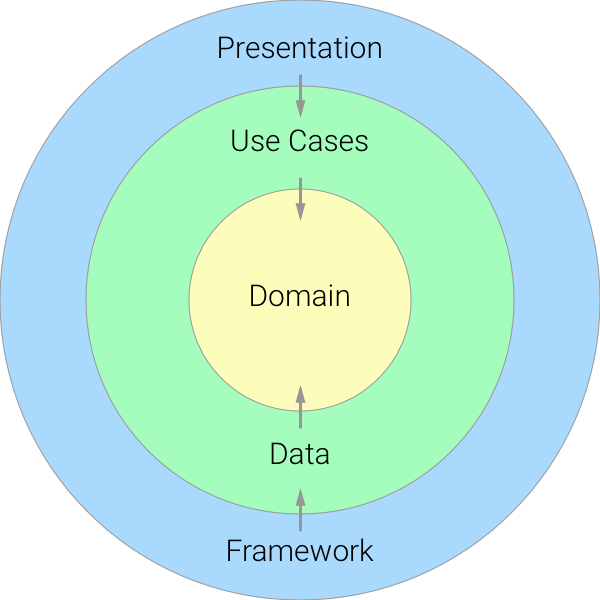
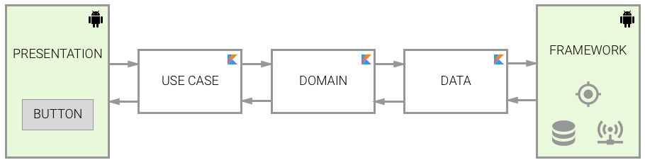
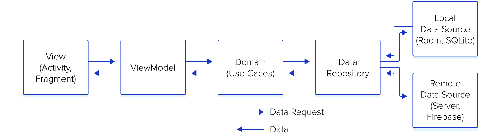
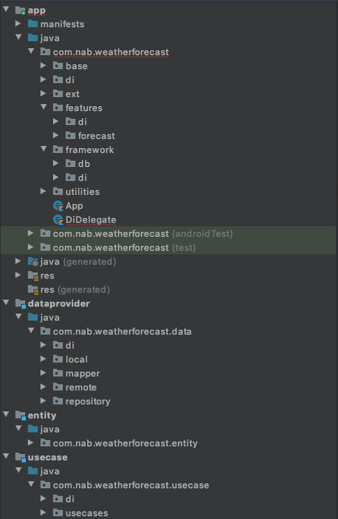

# weather_forecast

## Architecture

- 

- 

- 

- The `entity`/`domain`:
    * Only contains business models
- The `dataprovider`:
    * Provide data from repository:
        * Can get from remote source by using retrofit and map raw data model to business model
        * Or, get cached from local source by using room database from `framework`
- The `usecases`:
    * Provide the interaction with `dataprovider` for `app` UI
- The `framework`:
    * Implement caching by using Android framework: room database
- Main `app`:
    * Apply MVVM architecture
    * Apply Dependency Injection by using Dagger

## Code folder structure

- 
    * Contains 4 modules: `entirty`, `usecases`, `dataprovider`, and main `app`
    * `app` contains:
        * `base`: define some base classes that will be extented in the application
        * `di`: define dependency injection with application scope
        * `ext`: define extensions will be used in the application
        * `features`: separate application into many features will make it be easier on scaling up
        * `framework`: implementation of Android framework
## Framework, library and run
- Libraries/frameworks using in the application:
    *  Kotlin
    *  Coroutines
    *  Room
    *  Retrofit
    *  Dagger
    *  Rootbeer
    *  Mockito
- Required configurations:
    * AndroidSDK
    * Gradle 6.5
- Launch:
    * Windows
        * gradlew installRelease
    * MAC/Ubuntu
        * ./gradlew installRelease
    * Install from [v1.0](./../../releases/download/1.0/app-release.apk)
## Check list:

1. ✅    Programming language: Kotlin is required, Java is optional. 
2. ✅    Design app's architecture (suggest MVVM)
3. ✅    Apply LiveData mechanism
4. ✅    UI should be looks like in attachment.
5. ✅    Write Unit Tests
6. Acceptance Tests
7. ✅    Exception handling
8. ✅    Caching handling
9. Secure Android app from:
* ✅ Decompile APK
* ✅ Rooted device
* ✅ Data transmission via network
* Encryption for sensitive information
    - Can use [Crypto](./app/src/main/java/com/nab/weatherforecast/utilities/Crypto.kt) to `encrypt`/`decrypt` data with Android KeyStore API
10. Accessibility for Disability Supports:
* ✅ Talkback: Use a screen reader.
* ✅ Scaling Text: Display size and font size: To change the size of items on your screen, adjust the display size or font size.
11. ✅   Entity relationship diagram for the database and solution diagrams for the components, infrastructure design if any
12. Readme file includes:
* ✅ Brief explanation for the software development principles, patterns & practices being applied
* ✅ Brief explanation for the code folder structure and the key Java/Kotlin libraries and frameworks being used
* ✅ All the required steps in order to get the application run on local computer
* ✅ Check list of items the candidate has done.
